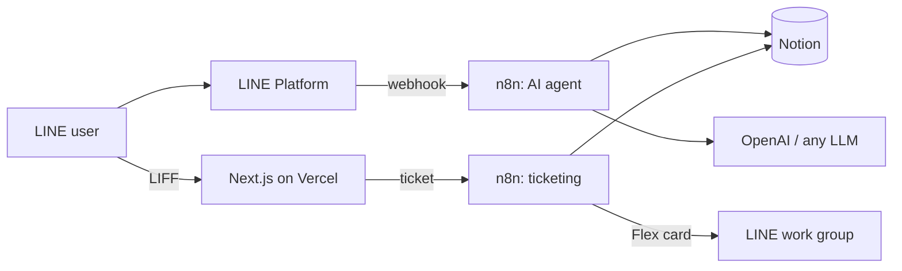
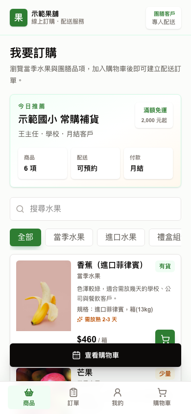
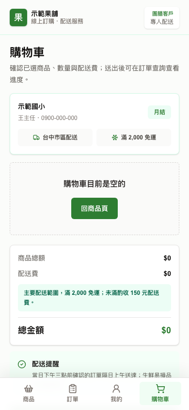
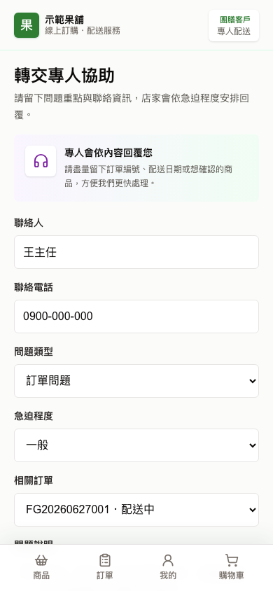

# line-n8n-support-starter

**Open-source LINE + n8n AI customer-service and ticketing starter kit for small businesses.**

[繁體中文說明 →](README.zh-TW.md)

Deploy a complete LINE Official Account service stack in an afternoon:

- 🤖 **AI customer service** — n8n workflow answers 1:1 LINE messages from a Notion knowledge base via any LLM
- 🛡️ **Group permission gate** — the bot only acts in whitelisted groups, for whitelisted users, when @-mentioned
- 🛒 **LIFF mini-site** — Next.js ordering/support site that runs inside LINE (products, cart, checkout, orders, member, support form)
- 🎫 **Human ticketing** — support requests become Notion tickets; the team drives the ticket lifecycle by tapping Flex Message buttons in a LINE group
- 🔄 **Draft → live content sync** — customers edit Notion draft databases freely; n8n "gatekeeper" workflows validate and sync to the live databases your app reads, so bad data never reaches production
- 🔐 **Webhook signature tooling** — local tester + unit tests pinned to LINE's documented signature example



<p align="center">
  
  
  
</p>

## Try it in 5 minutes (no accounts needed)

```bash
git clone https://github.com/yuipan0611/line-n8n-support-starter.git
cd line-n8n-support-starter
npm install
npm run dev
```

Open http://localhost:3000/liff/products — the site runs in **mock mode** with demo data, zero credentials required.

## Full deployment

Follow the [Quickstart](docs/quickstart.md) (~60–90 min): Notion → LINE channels → Vercel → n8n → end-to-end ticket flow, with a checkpoint after every stage.

## What's inside

| Path | Contents |
|---|---|
| `src/` | Next.js 16 App Router LIFF app (8 pages) + 3 API routes (catalog, ticket intake, postback state machine) |
| `workflows/` | n8n workflow JSONs: AI agent (A), ticketing (B), content sync (C1–C3), plus branch templates |
| `notion/` | Database schemas and a duplicable Notion template |
| `tools/line/` | Webhook signature tester, rich-menu builder/deployer, Flex Message generator |
| `docs/` | [Architecture](docs/architecture.md), [Quickstart](docs/quickstart.md), setup guides, troubleshooting |

## Docs

- [Quickstart](docs/quickstart.md) — the golden path
- [Architecture](docs/architecture.md) — how the pieces fit, and why
- Setup guides: [LINE](docs/setup-line.md) · [n8n](docs/setup-n8n.md) · [Notion](docs/setup-notion.md) · [Vercel](docs/deploy-vercel.md)
- [Webhook troubleshooting](docs/line-webhook-troubleshooting.md)

Some deep-dive docs are currently in Traditional Chinese (the kit was extracted from a production deployment at a Taiwanese merchant). Translations are very welcome — see [CONTRIBUTING.md](CONTRIBUTING.md).

## Development

```bash
npm run dev                # local dev server (mock mode without credentials)
npm run lint               # eslint
npm run typecheck          # tsc --noEmit
npm run test:line-webhook  # webhook signature unit tests
npm run check:leaks        # secret/identifier leak scan (also run in CI)
npm run build              # production build
```

## Roadmap

- [ ] v0.2: Notion database setup script via API (replace manual duplication)
- [ ] English demo data variant
- [ ] docker-compose for self-hosted n8n
- [ ] i18n for the LIFF UI

## License

[MIT](LICENSE)
