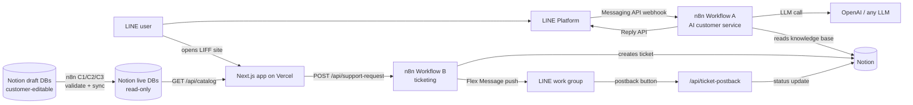

# Architecture

This starter kit wires four services together:



## Components

| Component | Where | Role |
|---|---|---|
| Next.js LIFF app | Vercel (or any Node host) | Ordering pages, member page, support form, order history |
| API routes | same Next.js app | `/api/catalog` (Notion live DBs → frontend, falls back to mock data), `/api/support-request` (ticket intake → n8n + Notion), `/api/ticket-postback` (LINE Flex button → Notion status machine) |
| n8n workflows | n8n Cloud or self-hosted | See below |
| Notion | notion.so | Knowledge base, product catalog, delivery rules, tickets, group registry |

## n8n workflows

The kit ships five workflow templates in [`workflows/`](../workflows/):

### A — LINE customer-service agent

Entry point for the LINE Messaging API webhook.

- Direct (1:1) messages: answered by an AI agent that reads the Notion knowledge base before calling the LLM, then replies via the LINE Reply API.
- Group messages: processed **only** when all of these hold — the group ID is whitelisted, the sender's user ID is whitelisted, and the bot is @-mentioned. Everything else is ignored silently, so the bot never floods a group or leaks internal data.

### B — LIFF support-ticket flow

Receives the payload from `/api/support-request`, creates a ticket page in the Notion tickets database, and pushes a Flex Message card to the whitelisted work group. Deliberately does **not** call an LLM — ticket intake stays fast and deterministic.

### C1 / C2 / C3 — draft → live content sync ("gatekeepers")

One workflow each for products, FAQ/knowledge, and delivery rules. Daily schedule plus manual trigger: read draft rows where `同步狀態 ≠ 已同步`, validate every field, upsert valid rows into the live database keyed by the stable `編號` (ID) column, and write the sync status (or a human-readable error) back to the draft row. Invalid data never reaches the live database — the app keeps serving the last good version.

Why they stay separate instead of one mega-workflow: A and B are production webhook entry points — merging them multiplies the blast radius of any edit. C1–C3 share a shape but differ in fields and validation rules, and are far easier to debug apart.

## Two-layer Notion database design

Notion cannot grant "edit content but not schema" permissions, so anyone with edit access can break the columns your automation depends on. The kit therefore uses **two databases per content type**:

- **Draft** — shared with the customer/merchant, freely editable.
- **Live** — shared with nobody; only the n8n sync workflow writes to it, and the app only reads from it.

Sync is strictly one-way (draft → live), guarded by validation, and rows are deactivated rather than deleted. Full design, field-by-field schemas, and validation rules: [two-layer-database-architecture.zh-TW.md](two-layer-database-architecture.zh-TW.md) (Traditional Chinese) and [`notion/schemas/`](../notion/schemas/).

## Ticket lifecycle

```
新工單 (new) → 已受理 (accepted) → 處理中 (in progress) → 待客戶確認 (awaiting confirmation) → 已完成 (done)
```

Each Flex Message card carries a postback button with `source=line_ticket_flex&issue_id=SR...&action=...&next_status=...`. The postback handler verifies the group whitelist, looks the ticket up by its ticket number, updates the status and the matching timestamp column, then pushes the next card. See [line-ticket-flex-message.md](line-ticket-flex-message.md).

## Security model

- **Webhook signatures**: every LINE webhook is verified against `x-line-signature` before any JSON parsing. Local tooling: `npm run line:webhook` / `npm run line:sample` (see [line-webhook-troubleshooting.md](line-webhook-troubleshooting.md)).
- **Group whitelist**: the bot acts only in registered groups (`notion/schemas/line-groups.md`); new groups are auto-registered as *disabled* and must be manually approved.
- **Least-privilege Notion sharing**: customers see draft databases only; the integration token is the only writer of live databases.
- **No secrets in the repo**: all credentials come from environment variables — see `.env.example` and [SECURITY.md](../SECURITY.md).
